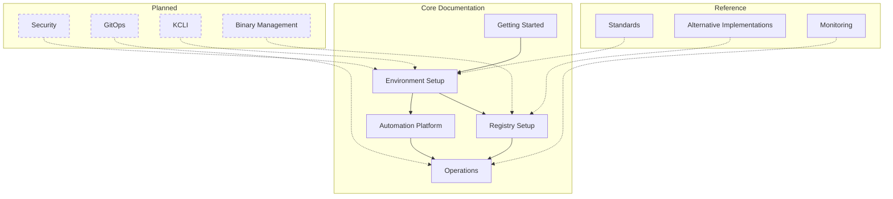

# Documentation Guide

## Overview

This documentation provides comprehensive guidance for setting up and managing a disconnected OpenShift environment. Each section aligns with our [Architecture Decision Records](adr/) and provides practical implementation details.

## Documentation Structure

### Core Documentation
Essential implementation guides and primary workflows.

#### Getting Started
- [Requirements](requirements.md) - System and environment requirements
- [Getting Started Guide](core/getting-started/getting-started.md) - Initial setup walkthrough
- [Environment Setup](environment/setup-guide.md) - Detailed environment configuration

#### Registry Management
- [Harbor Deployment Guide](core/registry/deploy-harbor-podman-compose.md) - Harbor registry setup
- [Pull-through Cache Setup](core/registry/pullthrough-proxy-cache-harbor.md) - Registry caching configuration

#### Automation Platform
- [AAP Deployment Guide](core/automation/deploy-aap-on-openshift.md) - Ansible Automation Platform setup
- [Rulebooks Guide](automation/rulebooks.md) - Event-Driven Ansible rulebooks

#### Environment Management
- [Decision Environments](environment/decision-environments.md) - Decision environment setup and usage
- [Execution Environments](environment/execution-environments.md) - Execution environment configuration
- [Development Workflow](environment/development-workflow.md) - Developer guide
- [Deployment Operations](environment/deployment-operations.md) - Operations guide
- [Dependency Management](environment/dependency-management.md) - Managing dependencies

### Reference Documentation
Additional implementation details, alternatives, and standards.

#### Alternative Implementations
- [JFrog Cache Setup](reference/alternative-implementations/pullthrough-proxy-cache-jfrog.md) - Alternative caching with JFrog
- [JFrog Deployment](reference/alternative-implementations/deploy-jfrog-podman.md) - JFrog container registry setup

#### Monitoring
- [Harbor Monitoring](reference/monitoring/harbor-monitoring.md) - Registry monitoring setup

#### Standards
- [YAML Standards](reference/standards/yaml-standards.md) - YAML file formatting and structure

## Missing Documentation (TODO)

### Security (ADR-0004)
- [ ] security/certificate-guide.md - Certificate management
- [ ] security/security-guide.md - Security best practices
- [ ] security/authentication.md - Authentication setup

### GitOps (ADR-0005)
- [ ] gitops/setup.md - GitOps configuration
- [ ] gitops/workflow.md - GitOps workflows
- [ ] gitops/best-practices.md - Best practices

### Binary Management (ADR-0006)
- [ ] binary-management/mirroring.md - Binary mirroring
- [ ] binary-management/updates.md - Update management
- [ ] binary-management/verification.md - Binary verification

### Monitoring (ADR-0007)
- [ ] monitoring/setup.md - Monitoring configuration
- [ ] monitoring/alerts.md - Alert configuration
- [ ] monitoring/dashboards.md - Dashboard setup

### Installation (ADR-0009)
- [ ] installation/agent-based.md - Agent installation
- [ ] installation/troubleshooting.md - Installation issues
- [ ] installation/validation.md - Installation validation

### KCLI (ADR-0014)
- [ ] kcli/setup.md - KCLI installation
- [ ] kcli/usage.md - KCLI usage guide
- [ ] kcli/automation.md - Automation with KCLI

## Documentation Standards

All documentation should follow our [YAML Standards](reference/standards/yaml-standards.md) and maintain consistent formatting. For documentation generation guidelines, see [Documentation Generation](documentation-generation.md).

## Contributing

To contribute to the documentation:

1. Check the "Missing Documentation" section above
2. Review relevant ADRs in [adr/](adr/)
3. Follow our documentation standards
4. Submit a pull request

## Documentation Map

Legend:
- Solid lines: Existing documentation
- Dashed lines: Reference or planned documentation 