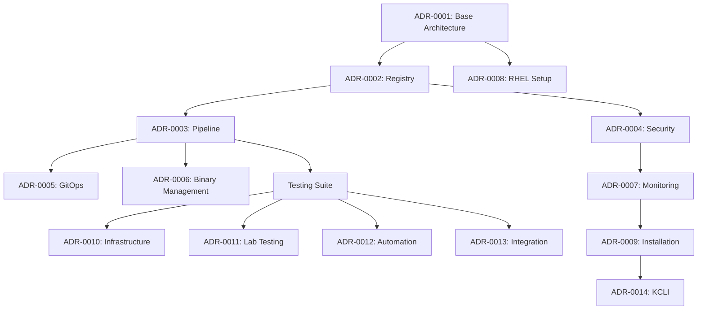

# Architecture Decision Records

## Overview

This directory contains Architecture Decision Records (ADRs) that document significant architectural decisions made in this project. Each ADR describes the context, decision, and consequences of a particular architectural choice.

For a high-level overview of how these decisions fit together, see our [Architecture Overview](../architecture/overview.md).

## Core Architecture Decisions

### Foundation
1. [ADR-0001: Disconnected OpenShift Architecture](0001-disconnected-openshift-architecture.md)
   - Implementation: [Base Architecture](../architecture/overview.md#system-architecture)
   - Related: [Requirements](../requirements.md)

### Infrastructure Management
2. [ADR-0002: Registry Management Strategy](0002-registry-management-strategy.md)
   - Implementation: 
     - [Harbor Setup](../harbor/deployment.md)
     - [Quay Setup](../../quay/)
     - [Pull-through Cache](../pullthrough-proxy-cache-harbor.md)

3. [ADR-0008: RHEL Scratch Setup](0008-rhel-scratch-setup.md)
   - Implementation: [Environment Setup](../getting-started.md)
   - Related: [System Requirements](../requirements.md)

### Automation & Pipeline
4. [ADR-0003: Pipeline Automation Approach](0003-pipeline-automation-approach.md)
   - Implementation: 
     - [Tekton Tasks](../../tekton/)
     - [GitHub Actions](.github/workflows/)
     - [Azure Pipelines](.azure/)

5. [ADR-0005: GitOps Implementation](0005-gitops-implementation.md)
   - Implementation: [Post-Install Configuration](../../post-install-config/)

### Security
6. [ADR-0004: Security Authentication Strategy](0004-security-authentication-strategy.md)
   - Implementation: 
     - [Certificate Management](../security/certificate-guide.md)
     - [Authentication Setup](../security/security-guide.md)

### Asset Management
7. [ADR-0006: Binary Management Strategy](0006-binary-management-strategy.md)
   - Implementation:
     - [Binary Mirroring](../../binaries/)
     - [RHCOS Assets](../../rhcos/)
     - [Release Images](../../openshift-release/)

### Operations
8. [ADR-0007: Monitoring Debugging Strategy](0007-monitoring-debugging-strategy.md)
   - Implementation: [Operations Guide](../operations/troubleshooting.md)

9. [ADR-0009: OpenShift Agent Installation](0009-openshift-agent-installation.md)
   - Implementation: [Installation Examples](../../installation-examples/)

10. [ADR-0014: KCLI Implementation Strategy](0014-kcli-implementation-strategy.md)
    - Implementation: [KCLI Setup](../kcli/setup.md)

### Testing & Quality
11. [ADR-0010: Testing Infrastructure](0010-testing-infrastructure.md)
    - Implementation: [Test Framework](../../tests/)

12. [ADR-0011: Lab Environment Testing](0011-lab-environment-testing.md)
    - Implementation: [Lab Setup](../lab/setup.md)

13. [ADR-0012: Test Automation Framework](0012-test-automation-framework.md)
    - Implementation: [CI/CD Tests](../../.github/workflows/)

14. [ADR-0013: Project Testing Integration](0013-project-testing-integration.md)
    - Implementation: [Integration Tests](../../tests/integration/)

## Using These ADRs

### For Developers
- Review relevant ADRs before making significant changes
- Reference ADRs in pull requests when implementing related features
- Propose new ADRs for significant architectural changes

### For Operators
- Use ADRs to understand the rationale behind implementation choices
- Reference ADRs when troubleshooting issues
- Consult ADRs when planning deployments

### For Contributors
- Follow the [template](template.md) when creating new ADRs
- Link new ADRs to existing ones when appropriate
- Update this index when adding new ADRs

## Status Key

- 🟢 **Accepted** - Decision implemented and proven
- 🟡 **Proposed** - Under discussion or review
- 🔵 **Superseded** - Replaced by newer decision
- ⚪ **Deprecated** - No longer relevant

## Implementation Map

