# ADR-001: Project Structure and ADR Process

## Status

Accepted

## Context

The Disconnected OpenShift project requires a clear documentation of its structure and the process for making and recording architectural decisions. This ADR establishes the baseline project structure and sets up the ADR process itself.

## Decision

We will maintain the following project structure, with each directory serving a specific purpose:

```mermaid
graph TD
    Root[Project Root] --> Docs[docs/]
    Root --> Git[.git/]
    Root --> Tekton[tekton/]
    Root --> Static[static/]
    Root --> Quay[quay/]
    Root --> RHCOS[rhcos/]
    Root --> Rulebooks[rulebooks/]
    Root --> Scripts[scripts/]
    Root --> OpenshiftRelease[openshift-release/]
    Root --> Playbooks[playbooks/]
    Root --> PostInstall[post-install-config/]
    Root --> InstallExamples[installation-examples/]
    Root --> Extras[extras/]
    Root --> GitOps[gitops/]
    Root --> ExecEnv[execution-environments/]
    Root --> Binaries[binaries/]
    Root --> DecisionEnv[decision-environments/]
    Root --> Azure[.azure/]
    Root --> GitHub[.github/]
    
    Docs --> ADR[adr/]
    Docs --> Architecture[architecture/]
    Docs --> Automation[automation/]
    Docs --> Core[core/]
    Docs --> Environment[environment/]
    Docs --> Harbor[harbor/]
    Docs --> Monitoring[monitoring/]
    Docs --> Pipeline[pipeline/]
    Docs --> Reference[reference/]
    Docs --> Security[security/]
```



### Complete Directory Structure with Files

#### Root Level
```
.
├── LICENSE
├── README.md
└── .gitignore
```

#### Binaries
```
binaries/
├── Containerfile
├── Containerfile.fips
├── README.md
├── azure-pipelines.yml
└── download-ocp-binaries.sh
```

#### Decision Environments
```
decision-environments/
└── auto-mirror-image/
    ├── ansible.cfg
    ├── decision-environment.yml
    ├── diy-decision-environment.yml
    ├── minimal-decision-environment.yml
    ├── requirements.txt
    ├── requirements.yml
    └── stream-decision-environment.yml
```

#### Documentation
```
docs/
├── README.md
├── disconnected-environment-plan.md
├── documentation-generation.md
├── documentation-map.md
├── environment/
│   ├── decision-environments.md
│   ├── dependency-management.md
│   ├── deployment-operations.md
│   ├── development-workflow.md
│   ├── execution-environments.md
│   └── setup-guide.md
├── harbor/
│   ├── deployment.md
│   └── harbor-deployment-plan.md
├── monitoring/
│   ├── cert-monitoring.md
│   ├── network-monitoring.md
│   └── security-monitoring.md
├── security/
│   ├── authentication.md
│   ├── certificate-guide.md
│   ├── network-security.md
│   └── security-guide.md
├── system-integration.md
├── tekton-setup.md
├── troubleshooting.md
└── workflow.md
```

#### Execution Environments
```
execution-environments/
├── auto-mirror-image/
│   ├── azure-pipelines.yml
│   ├── bindep.txt
│   ├── execution-environment.yml
│   ├── requirements.txt
│   └── requirements.yml
└── binaries/
    ├── azure-pipelines.yml
    ├── bindep.txt
    ├── execution-environment.yml
    ├── requirements.txt
    └── requirements.yml
```

#### Extras
```
extras/
├── README.md
├── http-mirror/
│   ├── README.md
│   └── manifests/
│       ├── 01_mirror-config.yml
│       ├── 02_root-ca-certs.yml
│       ├── 03_pvc.yml
│       ├── 05_deployment.yml
│       ├── 07_service.yml
│       └── 08_route.yml
└── nginx-container/
    └── README.md
```

#### GitOps
```
gitops/
├── README.md
└── common/
    ├── image-mirrors/
    │   ├── disconn-harbor.d70.kemo.labs/
    │   │   ├── imageDigestMirrorSet.yml
    │   │   ├── imageTagMirrorSet.yml
    │   │   └── kustomization.yml
    │   └── jfrog.lab.kemo.network/
    │       ├── imageDigestMirrorSet.yml
    │       ├── imageTagMirrorSet.yml
    │       └── kustomization.yml
    ├── outbound-proxy/
    │   └── [proxy configuration files]
    └── root-certificates/
        ├── Chart.yaml
        ├── certs/
        │   ├── kemo-labs-root-ca.pem
        │   ├── kemo-labs-stepca.pem
        │   ├── pgv-root-ca.pem
        │   └── serto-root-ca.pem
        ├── templates/
        │   ├── _helpers.tpl
        │   └── cert-manifest.yaml
        └── values.yaml
```

#### OpenShift Release
```
openshift-release/
├── Containerfile
├── entrypoint.sh
└── mirror-release.sh
```

#### Playbooks
```
playbooks/
├── auto-mirror-image/
│   ├── decision.yml
│   ├── main.yml
│   └── templates/
│       └── tekton-pipelinerun.yml.j2
└── harbor/
    ├── install-harbor.yml
    ├── inventory/
    ├── test-harbor-integration.yml
    └── vars/
        └── main.yml
```

#### Quay
```
quay/
├── config-secret.yml
└── quay-instance.yml
```

#### Rulebooks
```
rulebooks/
└── auto-image-mirror/
    ├── inventory/
    ├── prometheusRule.yml
    ├── requirements.txt
    ├── requirements.yml
    └── rulebook.yml
```

#### Scripts
```
scripts/
├── build_environment.sh
├── deploy-harbor-vm.sh
├── join-auths.sh
├── pull-secret-to-harbor-auth.sh
├── pull-secret-to-parts.sh
└── validate_environment.sh
```

#### Static
```
static/
├── harbor-complete-endpoints.jpg
├── harbor-complete-projects.jpg
├── harbor-endpoint-definition.jpg
├── harbor-new-endpoint.jpg
├── harbor-new-project.jpg
├── harbor-project-defintion.jpg
├── harbor-running-in-cockpit.jpg
├── jfrog-complete-repos.jpg
├── jfrog-configure-remote-repo.jpg
├── jfrog-create-repo.jpg
└── jfrog-http-settings.jpg
```

#### Tekton
```
tekton/
├── README.md
├── config/
│   ├── kustomization.yml
│   ├── mirror-registries.yml
│   ├── namespace.yml
│   ├── rbac.yml
│   └── root-ca.yml
├── containers/
│   └── Containerfile.skopeo-jq
├── kConfig-namespace.yml
├── kustomization.yml
├── pipeline-runs/
│   ├── binaries/
│   │   ├── 01_pvc.yml
│   │   └── 05_pipeline-run.yml
│   ├── openshift-release/
│   │   └── [release pipeline files]
│   └── skopeo-copy-disconnected/
│       └── 05_plr-skopeo-copy-disconnected-single.yml
├── pipelines/
│   ├── build-ocp-release-tools-container.yml
│   ├── kustomization.yml
│   ├── ocp-binary-tools.yml
│   └── [other pipeline definitions]
└── tasks/
    ├── buildah-disconnected.yml
    ├── kustomization.yml
    ├── ocp-release-tools.yml
    ├── scripts/
    │   ├── disconnected-config.sh
    │   └── skopeo-copy.sh
    └── skopeo-copy-disconnected.yml
```

### Directory Purposes

#### Root Level Directories
- `docs/`: Project documentation including ADRs, architecture, and guides
- `tekton/`: Tekton pipeline definitions and configurations
- `static/`: Static assets and resources (images, etc.)
- `quay/`: Quay-related configurations and scripts
- `rhcos/`: Red Hat CoreOS related resources
- `rulebooks/`: Automation rulebooks for image mirroring
- `scripts/`: Utility and automation scripts
- `openshift-release/`: OpenShift release configurations and mirroring
- `playbooks/`: Ansible playbooks for automation
- `post-install-config/`: Post-installation configuration resources
- `installation-examples/`: Example installation configurations
- `extras/`: Additional utilities including HTTP mirror and nginx container
- `gitops/`: GitOps configurations for image mirroring and certificates
- `execution-environments/`: Execution environment definitions
- `binaries/`: Required binary files and download scripts
- `decision-environments/`: Decision environment configurations
- `.azure/`: Azure-specific configurations
- `.github/`: GitHub workflows and configurations

#### Key Subdirectories

##### docs/
- `adr/`: Architectural Decision Records
- `architecture/`: System architecture documentation
- `automation/`: Automation-related documentation
- `core/`: Core functionality documentation
- `environment/`: Environment setup and management
- `harbor/`: Harbor registry documentation
- `monitoring/`: System monitoring documentation
- `pipeline/`: Pipeline setup and configuration
- `reference/`: Reference implementations and standards
- `security/`: Security guides and documentation

##### tekton/
- `config/`: Tekton configuration files
- `containers/`: Container definitions
- `pipeline-runs/`: Pipeline run definitions
- `pipelines/`: Pipeline definitions
- `tasks/`: Task definitions and scripts

##### gitops/
- `common/`: Common configurations
  - `image-mirrors/`: Image mirroring configurations
  - `outbound-proxy/`: Proxy configurations
  - `root-certificates/`: Certificate management

##### extras/
- `http-mirror/`: HTTP mirror service
- `nginx-container/`: Nginx container configurations

## Consequences

### Positive
- Clear organization of project components
- Established process for documenting architectural decisions
- Improved maintainability through structured documentation
- Better onboarding experience for new contributors
- Comprehensive documentation coverage across all aspects
- Clear separation of concerns between different components

### Negative
- Need to maintain ADR documentation alongside code changes
- Additional overhead in keeping documentation up-to-date
- Complex directory structure requires careful navigation
- Potential for documentation drift in deeply nested directories

## Implementation Notes

1. ADRs will be stored in `docs/adr/`
2. ADRs will be numbered sequentially starting from 001
3. ADRs will use Markdown format with Mermaid diagrams
4. The ADR index will be maintained in `docs/adr/README.md`
5. Each major component has its own documentation section
6. Configuration files are separated by purpose (GitOps, Tekton, etc.)
7. Scripts and automation are organized by function

## Related Documents

- Project README.md
- .gitignore configuration
- docs/documentation-map.md
- docs/workflow.md 