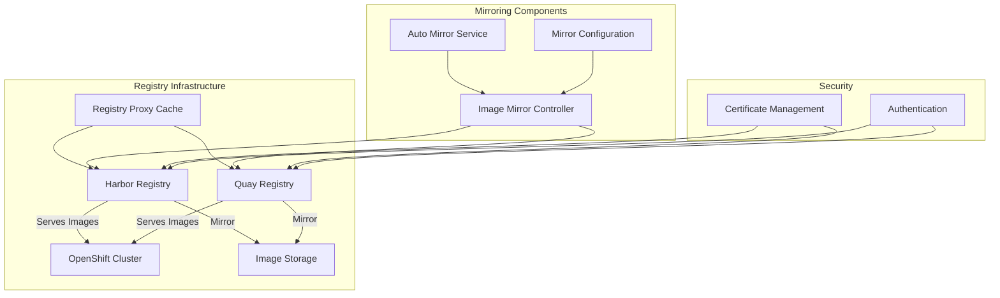

# ADR-002: Registry and Image Mirroring Architecture

## Status

Proposed

## Context

A disconnected OpenShift environment requires a robust container registry solution for storing and managing container images without direct internet access. The project supports both Harbor and Quay as registry options, with comprehensive image mirroring capabilities.

## Decision

We will implement a flexible registry architecture that supports both Harbor and Quay, with the following key components:



### Registry Components

1. **Harbor Registry Implementation**
   - Deployment via Podman Compose (`docs/core/registry/deploy-harbor-podman-compose.md`)
   - Pull-through proxy cache configuration (`docs/core/registry/pullthrough-proxy-cache-harbor.md`)
   - Project and endpoint management
   - Integration with existing certificate infrastructure

2. **Quay Registry Implementation**
   - Configuration via `quay/config-secret.yml`
   - Instance definition in `quay/quay-instance.yml`
   - Integration with OpenShift platform

3. **Image Mirroring System**
   - GitOps-based configuration (`gitops/common/image-mirrors/`)
   - Support for both digest and tag-based mirroring
   - Automated mirroring through rulebooks
   - Tekton pipeline integration

### Implementation Details

1. **Harbor-specific Configuration**
```yaml
# Example Harbor mirror configuration
mirrors:
  - name: "disconn-harbor.d70.kemo.labs"
    imageDigestMirrors:
      - source: "registry.redhat.io"
      - source: "quay.io"
    imageTagMirrors:
      - source: "registry.redhat.io"
      - source: "quay.io"
```

2. **Quay-specific Configuration**
```yaml
# Example Quay instance configuration
apiVersion: quay.redhat.com/v1
kind: QuayRegistry
metadata:
  name: disconnected-registry
spec:
  configBundleSecret: config-bundle-secret
  components:
    - kind: clair
    - kind: postgres
    - kind: redis
```

3. **Automation Components**
   - Auto-mirror image execution environment
   - Mirror decision playbooks
   - Prometheus monitoring rules

## Consequences

### Positive
- Flexible registry choice based on requirements
- Automated image mirroring reduces manual intervention
- GitOps-based configuration ensures consistency
- Comprehensive monitoring and automation
- Support for both synchronous and asynchronous mirroring
- Integration with existing security infrastructure

### Negative
- Increased complexity with multiple registry options
- Additional resource requirements for running multiple registries
- Need to maintain multiple sets of configurations
- Potential synchronization challenges between registries

## Implementation Notes

1. Registry Deployment:
   - Use provided playbooks for Harbor deployment
   - Follow operator-based approach for Quay
   - Implement health monitoring for both

2. Image Mirroring:
   - Configure mirror sets through GitOps
   - Implement automated mirroring through rulebooks
   - Set up monitoring and alerting

3. Security:
   - Integrate with existing certificate management
   - Implement role-based access control
   - Configure secure communication channels

4. Monitoring:
   - Deploy Prometheus rules for mirror status
   - Set up alerts for synchronization issues
   - Monitor storage utilization

## Related Documents

- [ADR-001](0001-project-structure.md) - Project Structure
- `docs/harbor/deployment.md`
- `docs/harbor/harbor-deployment-plan.md`
- `docs/core/registry/deploy-harbor-podman-compose.md`
 