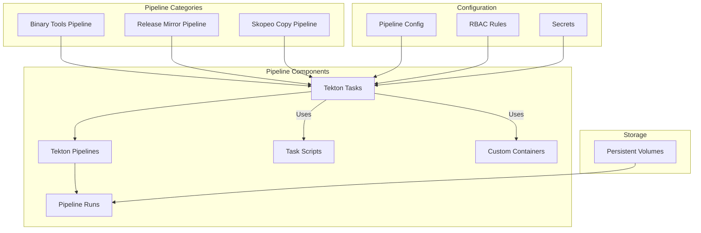

# ADR-003: Pipeline Architecture

## Status

Proposed

## Context

The disconnected OpenShift environment requires a robust pipeline system for automating image mirroring, binary downloads, and release management. Tekton has been chosen as the pipeline platform to handle these automation requirements.

## Decision

We will implement a Tekton-based pipeline architecture with the following structure:



### Pipeline Components

1. **Core Tasks**
   - `buildah-disconnected.yml`: Container image building in disconnected environment
   - `ocp-release-tools.yml`: OpenShift release management tools
   - `skopeo-copy-disconnected.yml`: Image copying in disconnected mode

2. **Pipeline Definitions**
   - Binary tools pipeline
   - OpenShift release mirroring
   - Skopeo copy operations
   - Release tools container building

3. **Pipeline Runs**
   - Binary mirroring
   - OpenShift release mirroring
   - Skopeo copy operations

### Implementation Details

1. **Task Configuration Example**
```yaml
# Example Task Definition
apiVersion: tekton.dev/v1beta1
kind: Task
metadata:
  name: skopeo-copy-disconnected
spec:
  workspaces:
    - name: scripts
    - name: config
  steps:
    - name: copy
      image: skopeo-jq:latest
      script: $(workspaces.scripts.path)/skopeo-copy.sh
```

2. **Pipeline Configuration Example**
```yaml
# Example Pipeline Definition
apiVersion: tekton.dev/v1beta1
kind: Pipeline
metadata:
  name: ocp-release-mirror
spec:
  workspaces:
    - name: shared-workspace
  tasks:
    - name: mirror-release
      taskRef:
        name: ocp-release-tools
      workspaces:
        - name: scripts
          workspace: shared-workspace
```

3. **Directory Structure**
```
tekton/
├── config/
│   ├── mirror-registries.yml
│   ├── namespace.yml
│   └── rbac.yml
├── containers/
│   └── Containerfile.skopeo-jq
├── pipeline-runs/
│   ├── binaries/
│   └── openshift-release/
├── pipelines/
│   └── [pipeline definitions]
└── tasks/
    └── [task definitions]
```

## Consequences

### Positive
- Standardized pipeline architecture across the project
- Reusable tasks and components
- Clear separation of configuration and implementation
- Scalable pipeline structure
- Integration with GitOps workflow
- Support for disconnected operations

### Negative
- Learning curve for Tekton-specific concepts
- Need to maintain custom task implementations
- Complex pipeline dependencies
- Resource requirements for pipeline execution

## Implementation Notes

1. Task Management:
   - Implement tasks with clear single responsibilities
   - Use workspaces for sharing data between tasks
   - Maintain script-based implementations for flexibility

2. Pipeline Configuration:
   - Use kustomize for environment-specific configurations
   - Implement proper RBAC controls
   - Configure resource requirements appropriately

3. Storage:
   - Use PVCs for persistent storage needs
   - Implement cleanup procedures
   - Monitor storage usage

4. Security:
   - Implement proper service accounts
   - Secure secret management
   - Network policy configuration

## Related Documents

- [ADR-001](0001-project-structure.md) - Project Structure
- [ADR-002](0002-registry-architecture.md) - Registry Architecture
- `docs/pipeline/setup.md`
- `docs/tekton-setup.md`
- `tekton/README.md` 