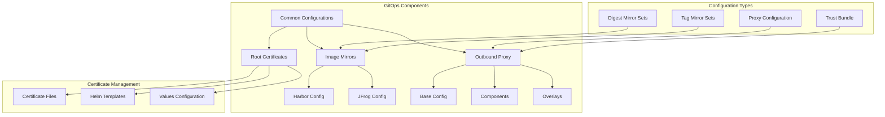

# ADR-004: GitOps Configuration Management

## Status

Proposed

## Context

The disconnected OpenShift environment requires a consistent and version-controlled approach to managing configurations across image mirroring, outbound proxies, and certificate management. GitOps principles are adopted to ensure declarative configuration management and automated synchronization.

## Decision

We will implement a GitOps-based configuration management system with the following structure:



### Directory Structure
```
gitops/
├── common/
│   ├── image-mirrors/
│   │   ├── disconn-harbor.d70.kemo.labs/
│   │   │   ├── imageDigestMirrorSet.yml
│   │   │   ├── imageTagMirrorSet.yml
│   │   │   └── kustomization.yml
│   │   └── jfrog.lab.kemo.network/
│   │       ├── imageDigestMirrorSet.yml
│   │       ├── imageTagMirrorSet.yml
│   │       └── kustomization.yml
│   ├── outbound-proxy/
│   │   ├── base/
│   │   ├── components/
│   │   └── overlays/
│   └── root-certificates/
│       ├── Chart.yaml
│       ├── certs/
│       ├── templates/
│       └── values.yaml
```

### Implementation Details

1. **Image Mirror Configuration**
```yaml
# Example imageDigestMirrorSet.yml
apiVersion: config.openshift.io/v1
kind: ImageDigestMirrorSet
metadata:
  name: disconnected-registry-mirrors
spec:
  imageDigestMirrors:
    - mirrors:
        - disconn-harbor.d70.kemo.labs/mirror
      source: registry.redhat.io
```

2. **Outbound Proxy Configuration**
```yaml
# Example proxy-config.yml
apiVersion: config.openshift.io/v1
kind: Proxy
metadata:
  name: cluster
spec:
  httpProxy: http://proxy.example.com:3128
  httpsProxy: http://proxy.example.com:3128
  noProxy: .cluster.local,.svc,10.0.0.0/8
```

3. **Certificate Management**
```yaml
# Example cert-manifest.yaml
apiVersion: v1
kind: ConfigMap
metadata:
  name: custom-ca
data:
  ca.crt: |
    {{ .Files.Get "certs/kemo-labs-root-ca.pem" | nindent 4 }}
```

## Consequences

### Positive
- Version-controlled configuration management
- Declarative configuration approach
- Automated configuration synchronization
- Clear separation of environment-specific configurations
- Reusable configuration components
- Standardized certificate management

### Negative
- Need to maintain multiple configuration variants
- Complexity in managing overlays and variants
- Requires understanding of Kustomize and Helm
- Certificate rotation complexity

## Implementation Notes

1. Configuration Management:
   - Use Kustomize for layered configuration
   - Implement clear base/overlay structure
   - Maintain environment-specific variations

2. Image Mirroring:
   - Support both digest and tag-based mirroring
   - Configure fallback mirrors
   - Implement mirror verification

3. Certificate Management:
   - Use Helm for certificate deployment
   - Implement certificate rotation procedures
   - Maintain trust bundle updates

4. Proxy Configuration:
   - Support both HTTP and HTTPS proxies
   - Configure proxy bypass rules
   - Implement proxy health monitoring

## Related Documents

- [ADR-001](0001-project-structure.md) - Project Structure
- [ADR-002](0002-registry-architecture.md) - Registry Architecture
- `gitops/README.md`
- `docs/core/registry/deploy-harbor-podman-compose.md` 