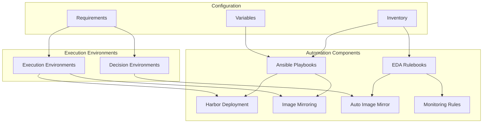

# ADR-005: Automation Framework

## Status

Proposed

## Context

The disconnected OpenShift environment requires comprehensive automation for image mirroring, system configuration, and ongoing maintenance. This is achieved through a combination of Ansible playbooks and Event-Driven Ansible (EDA) rulebooks.

## Decision

We will implement a multi-layered automation framework with the following structure:



### Directory Structure
```
playbooks/
├── auto-mirror-image/
│   ├── decision.yml
│   ├── main.yml
│   └── templates/
│       └── tekton-pipelinerun.yml.j2
└── harbor/
    ├── install-harbor.yml
    ├── inventory/
    ├── test-harbor-integration.yml
    └── vars/
        └── main.yml

rulebooks/
└── auto-image-mirror/
    ├── inventory/
    ├── prometheusRule.yml
    ├── requirements.txt
    ├── requirements.yml
    └── rulebook.yml

decision-environments/
└── auto-mirror-image/
    ├── ansible.cfg
    ├── decision-environment.yml
    ├── diy-decision-environment.yml
    ├── minimal-decision-environment.yml
    ├── requirements.txt
    ├── requirements.yml
    └── stream-decision-environment.yml
```

### Implementation Details

1. **Playbook Example**
```yaml
# Example harbor installation playbook
---
- name: Install Harbor Registry
  hosts: harbor_hosts
  vars_files:
    - vars/main.yml
  tasks:
    - name: Deploy Harbor using podman-compose
      include_role:
        name: harbor_deployment
```

2. **Rulebook Example**
```yaml
# Example auto-mirror rulebook
---
- name: Auto Mirror Image Rules
  hosts: all
  sources:
    - name: registry_webhook
      ansible.eda.webhook:
        host: 0.0.0.0
        port: 5000
  rules:
    - name: New Image Available
      condition: event.payload.action == "push"
      action:
        run_playbook:
          name: auto-mirror-image/main.yml
```

3. **Environment Configuration**
```yaml
# Example decision environment
---
version: 1
dependencies:
  galaxy: requirements.yml
  python: requirements.txt
  system: bindep.txt
additional_build_steps:
  prepend:
    - RUN pip3 install --upgrade pip setuptools
  append:
    - RUN pip3 install ansible-rulebook
```

## Consequences

### Positive
- Consistent automation across environments
- Event-driven automation capabilities
- Reusable automation components
- Clear separation of roles and responsibilities
- Integrated monitoring and alerting
- Standardized execution environments

### Negative
- Multiple automation technologies to maintain
- Complex dependency management
- Need for specialized knowledge (Ansible, EDA)
- Resource overhead for execution environments

## Implementation Notes

1. Playbook Management:
   - Implement role-based organization
   - Use variables for environment customization
   - Maintain clear documentation
   - Implement proper error handling

2. Rulebook Configuration:
   - Define clear event sources
   - Implement proper condition matching
   - Configure action throttling
   - Set up monitoring integration

3. Environment Management:
   - Standardize dependency management
   - Version control all requirements
   - Implement environment testing
   - Document build procedures

4. Integration:
   - Configure webhook security
   - Implement proper logging
   - Set up monitoring and alerting
   - Maintain audit trail

## Related Documents

- [ADR-001](0001-project-structure.md) - Project Structure
- [ADR-002](0002-registry-architecture.md) - Registry Architecture
- [ADR-003](0003-pipeline-architecture.md) - Pipeline Architecture
- `docs/automation/rulebooks.md`
- `docs/environment/decision-environments.md` 