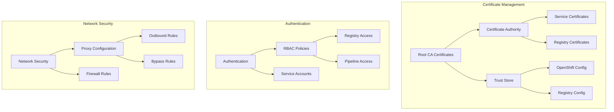

# ADR-006: Security and Certificate Management

## Status

Proposed

## Context

A disconnected OpenShift environment requires robust security measures and certificate management to ensure secure communication between components, proper authentication, and network security. This is particularly important for registry access, image signing, and internal service communication.

## Decision

We will implement a comprehensive security architecture with the following structure:



### Directory Structure
```
gitops/common/root-certificates/
├── Chart.yaml
├── certs/
│   ├── kemo-labs-root-ca.pem
│   ├── kemo-labs-stepca.pem
│   ├── pgv-root-ca.pem
│   └── serto-root-ca.pem
├── templates/
│   ├── _helpers.tpl
│   └── cert-manifest.yaml
└── values.yaml

docs/security/
├── authentication.md
├── certificate-guide.md
├── network-security.md
└── security-guide.md
```

### Implementation Details

1. **Certificate Management**
```yaml
# Example root CA configuration
apiVersion: v1
kind: ConfigMap
metadata:
  name: custom-ca-bundle
  namespace: openshift-config
data:
  ca-bundle.crt: |
    # Root CA Certificate
    {{ .Files.Get "certs/kemo-labs-root-ca.pem" | nindent 4 }}
    # StepCA Certificate
    {{ .Files.Get "certs/kemo-labs-stepca.pem" | nindent 4 }}
```

2. **RBAC Configuration**
```yaml
# Example RBAC policy
apiVersion: rbac.authorization.k8s.io/v1
kind: ClusterRole
metadata:
  name: registry-admin
rules:
  - apiGroups: [""]
    resources: ["secrets", "configmaps"]
    verbs: ["get", "list", "watch", "create", "update", "patch", "delete"]
  - apiGroups: ["image.openshift.io"]
    resources: ["imagestreams", "imagestreamtags"]
    verbs: ["get", "list", "watch", "create", "update", "patch", "delete"]
```

3. **Network Security**
```yaml
# Example proxy configuration
apiVersion: config.openshift.io/v1
kind: Proxy
metadata:
  name: cluster
spec:
  trustedCA:
    name: custom-ca-bundle
  httpProxy: http://proxy.example.com:3128
  httpsProxy: http://proxy.example.com:3128
  noProxy: .cluster.local,.svc,10.0.0.0/8
```

## Consequences

### Positive
- Centralized certificate management
- Consistent security policies
- Automated certificate deployment
- Clear authentication boundaries
- Standardized network security
- Comprehensive audit capabilities

### Negative
- Complex certificate lifecycle management
- Need for regular security updates
- Performance impact of security measures
- Additional operational overhead
- Complex troubleshooting requirements

## Implementation Notes

1. Certificate Management:
   - Implement automated certificate rotation
   - Configure proper certificate chain validation
   - Maintain certificate inventory
   - Set up expiration monitoring

2. Authentication:
   - Implement role-based access control
   - Configure service account permissions
   - Set up authentication monitoring
   - Maintain access audit logs

3. Network Security:
   - Configure proxy settings
   - Implement network policies
   - Set up network monitoring
   - Configure firewall rules

4. Security Monitoring:
   - Deploy security monitoring tools
   - Configure security alerts
   - Implement audit logging
   - Set up compliance checking

## Related Documents

- [ADR-001](0001-project-structure.md) - Project Structure
- [ADR-002](0002-registry-architecture.md) - Registry Architecture
- [ADR-004](0004-gitops-configuration.md) - GitOps Configuration
- `docs/security/certificate-guide.md`
- `docs/security/security-guide.md`
- `docs/security/network-security.md` 