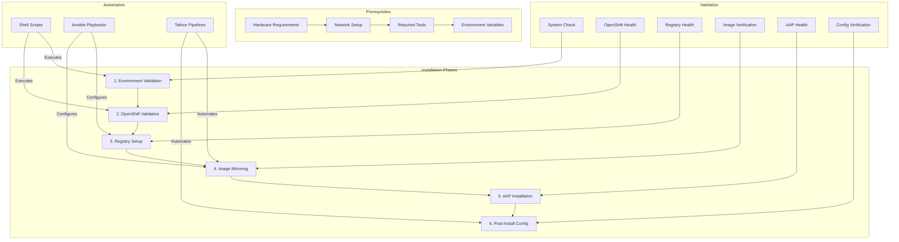

# ADR-007: Installation and Setup Process

## Status

Proposed

## Context

A disconnected OpenShift environment requires a carefully orchestrated installation and setup process to ensure all components are properly configured without direct internet access. This process needs to be reproducible, well-documented, and handle all dependencies effectively. The current implementation targets OpenShift 4.18.

## Decision

We will implement a structured installation and setup process with the following architecture:



### Prerequisites Checklist

1. **Hardware Requirements**
   ```bash
   # Minimum specifications
   - CPU: 8+ cores
   - RAM: 32GB+
   - Storage: 1TB+ available
   ```

2. **Network Requirements**
   ```bash
   # Required networks
   - Lab Network (<ip-address>/24)
   - Trans-Proxy Network (<ip-address>/24)
   ```

3. **Required Tools**
   ```bash
   # Core tools
   - podman
   - buildah
   - skopeo
   - ansible
   - OpenShift CLI (oc)
   ```

### Environment Variables

```bash
# Required OpenShift variables
KUBECONFIG=/path/to/kubeconfig
OPENSHIFT_PULL_SECRET="<pull-secret>"
OPENSHIFT_VERSION="4.18"
OPENSHIFT_MINOR_VERSION="4.18.0"
OPENSHIFT_ARCHITECTURE="x86_64"

# Required Harbor Registry variables
HARBOR_HOSTNAME=harbor.example.com
HARBOR_ADMIN_PASSWORD="your-secure-password"
REGISTRY_CERTIFICATE_PATH=/path/to/certs

# Optional proxy configuration
HTTP_PROXY=http://proxy.example.com:3128
HTTPS_PROXY=http://proxy.example.com:3128
NO_PROXY=localhost,127.0.0.1,.svc,.cluster.local
```

### Implementation Details

1. **OpenShift Validation**
```bash
# Verify cluster status
oc get clusterversion
oc get nodes
oc get co

# Check networking
oc get network.operator cluster -o yaml
oc get networkpolicies --all-namespaces

# Verify storage
oc get storageclass
oc get pv
```

2. **Registry Configuration**
```yaml
# Example registry configuration
apiVersion: config.openshift.io/v1
kind: ImageContentSourcePolicy
metadata:
  name: disconnected-registry
spec:
  repositoryDigestMirrors:
    - mirrors:
        - disconn-harbor.d70.kemo.labs/mirror
      source: registry.redhat.io
```

3. **Validation Checks**
```yaml
# Example validation playbook
- name: Validate Installation
  hosts: localhost
  tasks:
    - name: Check Registry Health
      uri:
        url: https://{{ registry_host }}/v2/_catalog
        validate_certs: yes
        status_code: 200

    - name: Verify OpenShift Cluster
      command: oc get clusterversion
      register: cv_status
```

## Consequences

### Positive
- Reproducible installation process
- Automated validation at each step
- Clear dependency management
- Documented prerequisites
- Integrated security setup
- Modular configuration approach
- Version-specific guidance

### Negative
- Complex initial setup requirements
- Multiple components to configure
- Need for careful sequence management
- Potential for environment-specific issues
- Required expertise across multiple tools
- Version-specific constraints

## Implementation Notes

1. Initial Setup:
   - Validate all prerequisites
   - Ensure network configuration
   - Verify storage requirements
   - Configure certificates
   - Set environment variables

2. OpenShift Setup:
   - Deploy OpenShift 4.18 cluster
   - Verify cluster health
   - Configure networking
   - Set up storage classes

3. Registry Setup:
   - Deploy Harbor registry
   - Configure authentication
   - Setup image mirroring
   - Verify connectivity

4. Post-Installation:
   - Apply security policies
   - Configure networking
   - Setup monitoring
   - Enable required operators

## Related Documents

- [ADR-001](0001-project-structure.md) - Project Structure
- [ADR-002](0002-registry-architecture.md) - Registry Architecture
- [ADR-006](0006-security-architecture.md) - Security Architecture
- `docs/core/getting-started/getting-started.md`
- `docs/environment/setup-guide.md`
- `installation-examples/README.md`
- `post-install-config/README.md` 