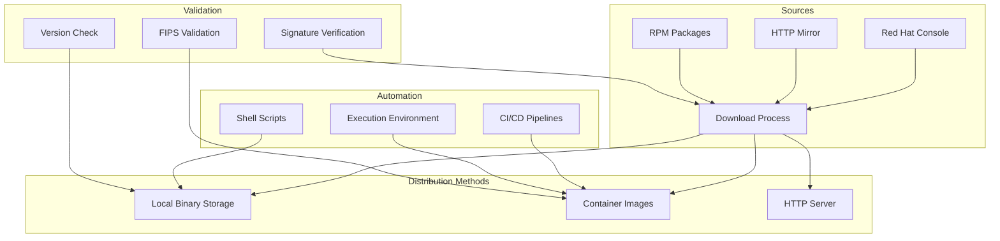

# ADR-008: Binary Management Strategy

## Status

Proposed

## Context

A disconnected OpenShift environment requires careful management of binary artifacts, including OpenShift CLI tools, installation utilities, and supporting binaries. These binaries must be available in the disconnected environment and need to support various architectures and FIPS requirements.

## Decision

We will implement a comprehensive binary management strategy with multiple distribution methods:



### Binary Components

1. **Core OpenShift Binaries**
   ```bash
   # Essential binaries
   - openshift-install
   - oc (OpenShift CLI)
   - kubectl
   - butane
   ```

2. **Additional Tools**
   ```bash
   # Platform-specific tools (x86_64/RHEL)
   - oc-mirror
   - opm
   - ccoctl
   ```

### Distribution Methods

1. **Local Binary Storage**
```bash
# Directory structure
./bin/
├── openshift-install
├── oc
├── kubectl
├── butane
├── oc-mirror    # x86_64 only
├── opm          # x86_64 only
└── ccoctl       # x86_64 only
```

2. **Container Image**
```dockerfile
# Example Containerfile
FROM registry.access.redhat.com/ubi9/ubi-minimal:latest

# Add OpenShift binaries
COPY --chmod=755 bin/* /usr/local/bin/

# Set environment
ENV PATH="/usr/local/bin:${PATH}"
```

3. **FIPS-Enabled Container**
```dockerfile
# Example FIPS Containerfile
FROM registry.access.redhat.com/ubi9/ubi-minimal:latest

# Enable FIPS mode
RUN fips-mode-setup --enable

# Add OpenShift binaries
COPY --chmod=755 bin/* /usr/local/bin/
```

### Implementation Details

1. **Download Process**
```bash
# Example download script
CHANNEL="stable-4.18"
ARCH="x86_64"
OS="linux"

# Download binaries
wget https://mirror.openshift.com/pub/openshift-v4/clients/ocp/${CHANNEL}/openshift-install-${OS}.tar.gz
wget https://mirror.openshift.com/pub/openshift-v4/clients/ocp/${CHANNEL}/openshift-client-${OS}.tar.gz
```

2. **Container Build**
```yaml
# Example pipeline configuration
stages:
  - stage: Build
    jobs:
      - job: BuildContainers
        steps:
          - script: |
              podman build -t ocp-tools -f binaries/Containerfile binaries/
              podman build -t ocp-tools-fips -f binaries/Containerfile.fips binaries/
```

3. **Validation Process**
```bash
# Version validation
oc version
openshift-install version

# FIPS validation
fips-mode-setup --check

# Binary verification
gpg --verify openshift-install.sig openshift-install
```

## Consequences

### Positive
- Multiple distribution methods
- FIPS compliance support
- Automated updates via pipelines
- Version control and tracking
- Architecture-specific support
- Containerized deployment option
- Simplified maintenance

### Negative
- Storage requirements for multiple versions
- Complex FIPS requirements
- Architecture limitations for some tools
- Container image size considerations
- Version synchronization challenges
- Regular updates needed

## Implementation Notes

1. Binary Management:
   - Use version-specific downloads
   - Implement checksum verification
   - Support multiple architectures
   - Handle FIPS requirements
   - Maintain binary compatibility

2. Distribution:
   - Configure HTTP mirrors
   - Set up container registries
   - Manage storage locations
   - Handle access controls

3. Automation:
   - Implement CI/CD pipelines
   - Schedule regular updates
   - Automate validation
   - Monitor binary health

4. Security:
   - Verify signatures
   - Implement FIPS when required
   - Secure storage access
   - Monitor vulnerabilities

## Related Documents

- [ADR-001](0001-project-structure.md) - Project Structure
- [ADR-007](0007-installation-setup-process.md) - Installation Process
- `binaries/README.md`
- `binaries/download-ocp-binaries.sh`
- `docs/environment/setup-guide.md`
- `.github/workflows/binaries-build-container.yml`
- `tekton/pipelines/binaries.yml` 