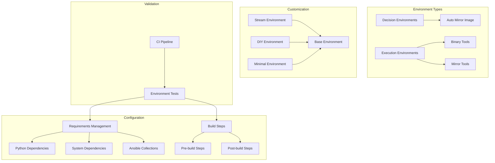

# ADR-009: Environment Types and Management

## Status

Proposed

## Context

The disconnected OpenShift environment requires different types of execution environments for various automation tasks. This includes Decision Environments for Event-Driven Ansible (EDA) and Execution Environments for standard automation tasks. Each environment type serves specific purposes and needs to be properly managed.

## Decision

We will implement a structured environment management system with distinct environment types:



### Directory Structure
```
decision-environments/
└── auto-mirror-image/
    ├── ansible.cfg
    ├── decision-environment.yml
    ├── diy-decision-environment.yml
    ├── minimal-decision-environment.yml
    ├── requirements.txt
    ├── requirements.yml
    └── stream-decision-environment.yml

execution-environments/
├── auto-mirror-image/
│   ├── azure-pipelines.yml
│   ├── bindep.txt
│   ├── execution-environment.yml
│   ├── requirements.txt
│   └── requirements.yml
└── binaries/
    ├── azure-pipelines.yml
    ├── bindep.txt
    ├── execution-environment.yml
    ├── requirements.txt
    └── requirements.yml
```

### Implementation Details

1. **Decision Environment Configuration**
```yaml
# Example decision-environment.yml
---
version: 1
dependencies:
  python: requirements.txt
  system: bindep.txt
  ansible: requirements.yml

additional_build_steps:
  prepend:
    - RUN pip3 install --upgrade pip setuptools
  append:
    - RUN pip3 install ansible-rulebook
    - RUN ansible-galaxy collection install -r requirements.yml

images:
  base_image: registry.redhat.io/ansible-automation-platform/ee-minimal-rhel8:latest
```

2. **Execution Environment Configuration**
```yaml
# Example execution-environment.yml
---
version: 1
build_arg_defaults:
  EE_BASE_IMAGE: 'registry.redhat.io/ansible-automation-platform/ee-supported-rhel8:latest'

dependencies:
  galaxy: requirements.yml
  python: requirements.txt
  system: bindep.txt

additional_build_steps:
  prepend:
    - RUN dnf -y install skopeo
  append:
    - RUN alternatives --set python /usr/bin/python3
```

3. **Requirements Management**
```yaml
# Example requirements.yml
---
collections:
  - name: ansible.utils
    version: 2.9.0
  - name: community.general
    version: 6.3.0
  - name: containers.podman
    version: 1.10.1

# Example requirements.txt
ansible-rulebook>=0.12.0
jmespath>=1.0.1
kubernetes>=26.1.0
openshift>=0.13.1
```

### Environment Types

1. **Decision Environments**
   - Purpose: Event-driven automation and decision making
   - Components:
     - Ansible Rulebook runtime
     - Event processing capabilities
     - Decision logic handlers
   - Use Cases:
     - Auto image mirroring
     - Event-based triggers
     - Automated decision making

2. **Execution Environments**
   - Purpose: Task execution and automation
   - Components:
     - Container runtime tools
     - Automation utilities
     - Required binaries
   - Use Cases:
     - Binary management
     - Image mirroring
     - System configuration

3. **Environment Variants**
   - Stream: Latest package versions
   - DIY: Custom configuration
   - Minimal: Basic requirements only

## Consequences

### Positive
- Clear separation of environment types
- Consistent dependency management
- Reproducible environments
- Version-controlled configurations
- Flexible customization options
- Automated build process

### Negative
- Multiple environments to maintain
- Complex dependency management
- Storage requirements for images
- Build time overhead
- Version compatibility challenges

## Implementation Notes

1. Environment Management:
   - Use containerized environments
   - Implement version control
   - Automate builds
   - Monitor resource usage

2. Dependency Management:
   - Lock dependency versions
   - Regular updates
   - Security scanning
   - Compatibility testing

3. Build Process:
   - Automated CI/CD
   - Image optimization
   - Cache management
   - Version tagging

4. Validation:
   - Environment testing
   - Dependency verification
   - Performance monitoring
   - Security checks

## Related Documents

- [ADR-001](0001-project-structure.md) - Project Structure
- [ADR-005](0005-automation-framework.md) - Automation Framework
- [ADR-007](0007-installation-setup-process.md) - Installation Process
- `docs/environment/decision-environments.md`
- `docs/environment/execution-environments.md`
- `docs/environment/dependency-management.md` 