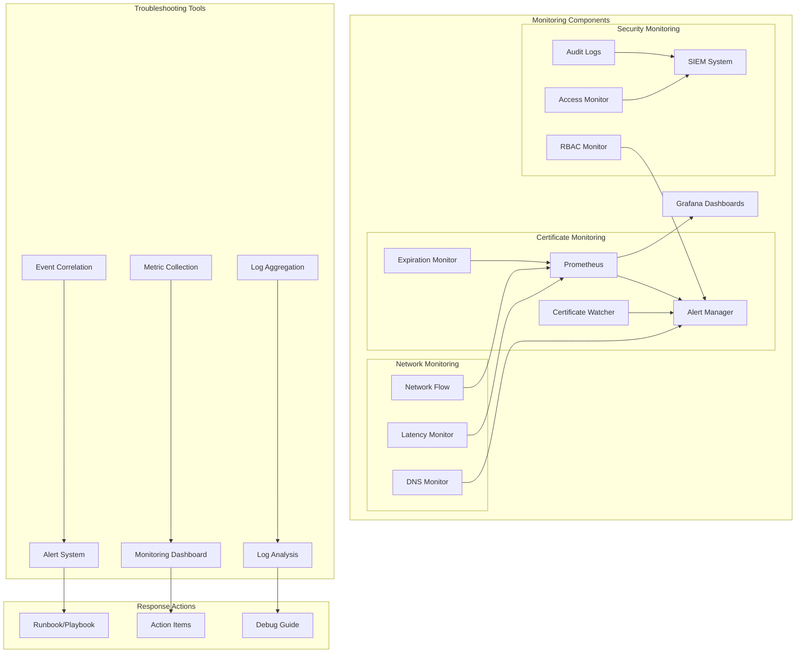

# ADR-010: Monitoring and Troubleshooting Architecture

## Status

Proposed

## Context

A disconnected OpenShift environment requires comprehensive monitoring and troubleshooting capabilities to ensure system health, detect issues early, and facilitate rapid problem resolution. This is particularly important in disconnected environments where external support resources may be limited.

## Decision

We will implement a multi-layered monitoring and troubleshooting architecture:



### Monitoring Components

1. **Certificate Monitoring**
```yaml
# Example PrometheusRule for certificate monitoring
apiVersion: monitoring.coreos.com/v1
kind: PrometheusRule
metadata:
  name: cert-monitor
spec:
  groups:
  - name: certificate.rules
    rules:
    - alert: CertificateExpirationWarning
      expr: cert_expiry_days < 30
      labels:
        severity: warning
```

2. **Network Monitoring**
```yaml
# Example network monitoring configuration
apiVersion: monitoring.coreos.com/v1
kind: ServiceMonitor
metadata:
  name: network-monitor
spec:
  endpoints:
  - port: metrics
    interval: 30s
  selector:
    matchLabels:
      app: network-monitor
```

3. **Security Monitoring**
```yaml
# Example audit policy
apiVersion: audit.k8s.io/v1
kind: Policy
metadata:
  name: audit-policy
rules:
  - level: Metadata
    resources:
    - group: ""
      resources: ["secrets", "configmaps"]
```

### Implementation Details

1. **Prometheus Configuration**
```yaml
# Example Prometheus configuration
apiVersion: monitoring.coreos.com/v1
kind: Prometheus
metadata:
  name: prometheus
spec:
  serviceMonitorSelector:
    matchLabels:
      team: frontend
  resources:
    requests:
      memory: 400Mi
```

2. **Alert Rules**
```yaml
# Example alert rules
groups:
- name: example
  rules:
  - alert: HighLatency
    expr: http_request_duration_seconds > 1
    for: 10m
    labels:
      severity: warning
    annotations:
      summary: High latency detected
```

3. **Grafana Dashboards**
```json
{
  "dashboard": {
    "id": null,
    "title": "System Overview",
    "panels": [
      {
        "title": "CPU Usage",
        "type": "graph",
        "datasource": "Prometheus"
      }
    ]
  }
}
```

### Troubleshooting Procedures

1. **Log Collection**
```bash
# Collect system logs
oc adm must-gather

# Analyze specific component
oc logs -n openshift-monitoring prometheus-k8s-0

# Export metrics
curl -k https://prometheus-k8s.openshift-monitoring:9091/metrics
```

2. **Network Diagnostics**
```bash
# Check network connectivity
oc debug node/<node> -- chroot /host ip addr

# Test DNS resolution
oc debug node/<node> -- chroot /host nslookup api.<cluster>
```

3. **Security Auditing**
```bash
# Review audit logs
oc adm node-logs --role=master --path=audit/audit.log

# Check RBAC
oc auth can-i --list --namespace=default
```

## Consequences

### Positive
- Comprehensive monitoring coverage
- Early warning system for issues
- Automated alert responses
- Detailed troubleshooting data
- Security audit capabilities
- Performance tracking
- Historical data analysis

### Negative
- Resource overhead for monitoring
- Storage requirements for logs
- Alert fatigue potential
- Configuration complexity
- Performance impact
- Maintenance overhead

## Implementation Notes

1. Monitoring Setup:
   - Deploy Prometheus Operator
   - Configure ServiceMonitors
   - Set up AlertManager rules
   - Create Grafana dashboards
   - Enable audit logging

2. Alert Configuration:
   - Define alert thresholds
   - Configure notification channels
   - Create escalation policies
   - Set up on-call rotations
   - Document response procedures

3. Troubleshooting Tools:
   - Install debug tools
   - Configure log aggregation
   - Set up metric collection
   - Create troubleshooting guides
   - Document common issues

4. Security Monitoring:
   - Enable audit logging
   - Configure RBAC monitoring
   - Set up access tracking
   - Implement security alerts
   - Document incident response

## Related Documents

- [ADR-006](0006-security-architecture.md) - Security Architecture
- [ADR-007](0007-installation-setup-process.md) - Installation Process
- `docs/monitoring/cert-monitoring.md`
- `docs/monitoring/network-monitoring.md`
- `docs/monitoring/security-monitoring.md`
- `docs/troubleshooting.md`
- `rulebooks/auto-image-mirror/prometheusRule.yml` 