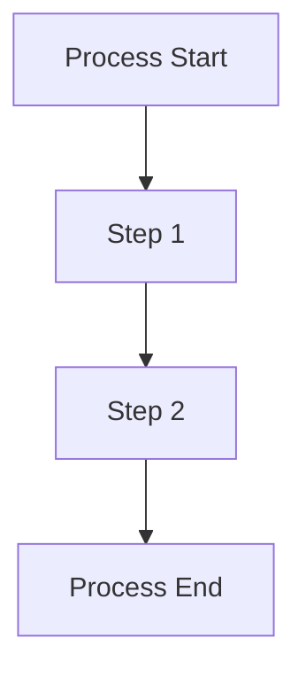

# Architectural Decision Records (ADRs)

This directory contains the Architectural Decision Records (ADRs) for the Disconnected OpenShift project.

## What is an ADR?

An Architectural Decision Record (ADR) is a document that captures an important architectural decision made along with its context and consequences.

## ADR Format

Each ADR is written in Markdown and follows this template:

```markdown
# ADR-NNN: Title

## Status

[Proposed, Accepted, Deprecated, Superseded]

## Context

The context behind the decision and its drivers.

## Decision

The decision that was made.

## Consequences

What becomes easier or more difficult because of this decision.

## Implementation Notes

Specific implementation details and considerations.

## Related Documents

Links to related documentation, diagrams, or other ADRs.
```

## Mermaid Diagrams

We use Mermaid for diagrams within our ADRs. Example:



## ADR Index

* [ADR-001](0001-project-structure.md) - Project Structure and ADR Process
* [ADR-002](0002-registry-architecture.md) - Registry and Image Mirroring Architecture
* [ADR-003](0003-pipeline-architecture.md) - Pipeline Architecture
* [ADR-004](0004-gitops-configuration.md) - GitOps Configuration Management
* [ADR-005](0005-automation-framework.md) - Automation Framework
* [ADR-006](0006-security-architecture.md) - Security and Certificate Management
* [ADR-007](0007-installation-setup-process.md) - Installation and Setup Process
* [ADR-008](0008-binary-management.md) - Binary Management Strategy
* [ADR-009](0009-environment-types.md) - Environment Types and Management
* [ADR-010](0010-monitoring-troubleshooting.md) - Monitoring and Troubleshooting Architecture
* [ADR-012](0012-development-workflow.md) - Development Workflow 