# Documentation Map

## Overview

This document provides a comprehensive map of all documentation in the project, showing how different components relate to each other and guiding users through the documentation structure.

## Documentation Structure

```mermaid
graph TD
    %% Core Documentation
    README[README.md] --> GS[Getting Started]
    README --> ARCH[Architecture Overview]
    README --> REQS[Requirements]
    
    %% Environment Setup
    GS --> ENV[Environment Setup]
    ENV --> DE[Decision Environments]
    ENV --> EE[Execution Environments]
    ENV --> DISC[Disconnected Setup]
    
    %% Decision & Execution Environments
    DE --> DE_STD[Standard Environment]
    DE --> DE_MIN[Minimal Environment]
    DE --> DE_STREAM[Stream Environment]
    
    EE --> EE_MIRROR[Auto Mirror Environment]
    EE --> EE_BIN[Binary Management]
    
    %% Automation Components
    ARCH --> AUTO[Automation]
    AUTO --> RULE[Rulebooks]
    AUTO --> PLAY[Playbooks]
    AUTO --> PIPE[Pipelines]
    
    %% Registry Management
    ARCH --> REG[Registry Management]
    REG --> HARBOR[Harbor Setup]
    REG --> QUAY[Quay Setup]
    REG --> MIRROR[Image Mirroring]
    
    %% Security
    ARCH --> SEC[Security]
    SEC --> CERT[Certificates]
    SEC --> AUTH[Authentication]
    SEC --> NETPOL[Network Policies]
    
    %% Monitoring
    ARCH --> MON[Monitoring]
    MON --> METRICS[Metrics Collection]
    MON --> ALERTS[Alert Management]
    MON --> DASH[Dashboards]
    
    %% Infrastructure
    ARCH --> INFRA[Infrastructure]
    INFRA --> NGINX[Nginx Setup]
    INFRA --> PROXY[Proxy Configuration]
    INFRA --> DNS[DNS Setup]

    %% Style Definitions
    classDef complete fill:#d4edda,stroke:#155724;
    classDef inProgress fill:#fff3cd,stroke:#856404;
    classDef missing fill:#f8d7da,stroke:#721c24;
    classDef core fill:#cce5ff,stroke:#004085;

    %% Apply Classes
    class README,GS,ARCH,REQS core;
    class DE,EE,RULE complete;
    class AUTO,REG,SEC,MON inProgress;
    class INFRA,NGINX,PROXY missing;
```



## Component Relationships

### 1. Environment Layer
- [Decision Environments Guide](environment/decision-environments.md)
  - Connects to: Automation Rulebooks, Playbooks
  - Dependencies: Container Registry
- [Execution Environments Guide](environment/execution-environments.md)
  - Connects to: Binary Management, Image Mirroring
  - Dependencies: Container Registry, Authentication

### 2. Automation Layer
- [Rulebooks Guide](automation/rulebooks.md)
  - Connects to: Decision Environments, Monitoring
  - Dependencies: Event-Driven Ansible
- [Playbooks Documentation](automation/playbooks.md)
  - Connects to: Execution Environments, Registry Management
  - Dependencies: Ansible Core

### 3. Infrastructure Layer
- [Registry Management](registry/README.md)
  - Connects to: Security, Monitoring
  - Components: Harbor, Quay
- [Network Configuration](network/README.md)
  - Connects to: Security, DNS
  - Components: Proxy, Firewall

## Documentation Status

### Complete Documentation
1. ✅ Decision Environments
   - Standard Environment
   - Minimal Environment
   - Stream Environment
2. ✅ Execution Environments
   - Auto Mirror Environment
   - Binary Management
3. ✅ Automation Rulebooks
   - Event Rules
   - Prometheus Rules

### In Progress
1. 🟡 Registry Management
   - Harbor Setup
   - Quay Configuration
2. 🟡 Security
   - Certificate Management
   - Authentication
3. 🟡 Monitoring
   - Metrics
   - Alerts

### Missing Documentation
1. ❌ Infrastructure
   - Nginx Setup
   - Proxy Configuration
2. ❌ Network Management
   - DNS Configuration
   - Firewall Rules

## Navigation Guides

### 1. New User Path
1. Start with [Getting Started](getting-started.md)
2. Review [Requirements](requirements.md)
3. Follow [Environment Setup](environment/setup.md)
4. Configure [Decision Environments](environment/decision-environments.md)

### 2. Administrator Path
1. Review [Architecture Overview](architecture/overview.md)
2. Configure [Security](security/README.md)
3. Set up [Monitoring](monitoring/README.md)
4. Manage [Infrastructure](infrastructure/README.md)

### 3. Developer Path
1. Set up [Execution Environments](environment/execution-environments.md)
2. Configure [Automation](automation/rulebooks.md)
3. Implement [Playbooks](automation/playbooks.md)
4. Monitor [Metrics](monitoring/metrics.md)

## Cross-Cutting Concerns

### 1. Security
- Certificate management affects all components
- Authentication spans multiple services
- Network policies impact connectivity

### 2. Monitoring
- Metrics collection across components
- Centralized alerting
- Performance monitoring

### 3. Automation
- Event-driven operations
- Automated recovery
- Configuration management

## Maintenance Guidelines

### 1. Documentation Updates
- Keep component relationships current
- Update status indicators
- Maintain navigation paths

### 2. Version Control
- Document version dependencies
- Track configuration changes
- Maintain changelog

### 3. Quality Assurance
- Verify documentation links
- Test code examples
- Update troubleshooting guides

## Next Steps

1. Complete missing documentation
2. Enhance component relationships
3. Add detailed examples
4. Implement feedback mechanisms

# Disconnected OpenShift Lab Guide

## Overview
This guide provides step-by-step instructions for setting up and managing a disconnected OpenShift environment with integrated registry and automation capabilities.

## Core Implementation Guide

### Part 1: Foundation (Prerequisites & Base Setup)
1. [Introduction](getting-started.md)
   - Project Overview & Goals
   - Lab Environment Architecture
   - Prerequisites Checklist
   - Expected Outcomes

2. [Base Environment Setup](environment/setup.md)
   - System Requirements
   - Network Prerequisites
   - Tool Installation
     - Podman/Docker
     - Ansible
     - OpenShift CLI (oc)
     - Required Additional CLIs
   - Initial Environment Validation

3. [Network Configuration](network/README.md)
   - Basic <base64-credentials>
   - Proxy Configuration
   - DNS Setup
   - Initial Connectivity Testing
   - Lab Exercise: Basic <base64-credentials>

### Part 2: OpenShift Core Setup
1. [OpenShift Infrastructure Planning](openshift/infrastructure-planning.md)
   - Architecture Overview
   - Resource Requirements
   - Network Planning
   - Storage Planning
   - Lab Exercise: Infrastructure Planning

2. [OpenShift Installation Prerequisites](openshift/prerequisites.md)
   - DNS Configuration
   - Load Balancer Setup
   - Certificate Requirements
   - Pull Secret Management
   - Lab Exercise: Prerequisites Validation

3. [Disconnected OpenShift Installation](openshift/disconnected-install.md)
   - Mirror Registry Setup
   - OpenShift Images Mirroring
   - Installation Process
   - Initial Operator Configuration
   - Lab Exercise: OpenShift Installation

4. [Post-Installation Configuration](openshift/post-install.md)
   - Cluster Operator Verification
   - Authentication Setup
   - Storage Configuration
   - Network Policy Setup
   - Lab Exercise: Post-Install Validation

### Part 3: Registry Setup
1. [Harbor Deployment](registry/deploy-harbor-podman-compose.md)
   - Harbor Architecture
   - Podman Compose Setup
   - Certificate Configuration
   - Initial Configuration
   - Lab Exercise: Harbor Deployment

2. [Pull-Through Cache Configuration](registry/pullthrough-proxy-cache-harbor.md)
   - Cache Architecture
   - Harbor Cache Setup
   - Cache Validation
   - Lab Exercise: Cache Configuration

### Part 4: Ansible Automation Platform
1. [AAP on OpenShift](automation/deploy-aap-on-openshift.md)
   - Prerequisites
   - Operator Installation
   - Controller Deployment
   - EDA Controller Setup
   - Lab Exercise: AAP Deployment

2. [AAP Configuration](automation/aap-configuration.md)
   - Authentication Setup
   - Project Creation
   - Execution Environment Registration
   - Lab Exercise: AAP Setup

## Learning Paths

### 🔰 Beginner Path (3-4 days)
1. **Day 1: Foundation**
   - Complete Part 1: Foundation
   - Basic <base64-credentials>
   - Tool installation

2. **Day 2: OpenShift Setup**
   - OpenShift prerequisites
   - Basic <base64-credentials>
   - Initial configuration

3. **Day 3: Registry Setup**
   - Harbor deployment
   - Basic <base64-credentials>
   - Pull-through cache setup

4. **Day 4: Basic <base64-credentials>
   - AAP installation
   - Basic <base64-credentials>
   - Initial validation

### 👨‍🔧 Administrator Path (4-5 days)
1. **Day 1: Foundation**
   - Complete Foundation
   - Advanced networking
   - Infrastructure planning

2. **Day 2: OpenShift Installation**
   - Prerequisites setup
   - Disconnected installation
   - Initial configuration

3. **Day 3: Registry Setup**
   - Harbor deployment
   - Cache configuration
   - Security setup

4. **Day 4: AAP Implementation**
   - AAP operator installation
   - Controller configuration
   - Initial automation setup

5. **Day 5: Integration**
   - End-to-end testing
   - Validation
   - Documentation

## Lab Exercise Template

### 🎯 Learning Objectives
- Clear, measurable goals
- Expected outcomes
- Skills acquired

### ⚙️ Prerequisites
- Required components
- Required access
- Required knowledge

### 📝 Lab Steps
1. Preparation
   - Environment check
   - Tool verification
   - Access validation

2. Implementation
   - Step-by-step instructions
   - Command examples
   - Configuration samples

3. Validation
   - Testing procedures
   - Expected results
   - Success criteria

### ✅ Validation Checklist
- [ ] Environment setup verified
- [ ] Components installed
- [ ] Configuration completed
- [ ] Tests passed

## Reference Materials

### Alternative Implementations
1. [JFrog Container Registry](reference/deploy-jfrog-podman.md)
   - Alternative to Harbor
   - Different architecture approach
   - Cache configuration options

2. [JFrog Pull-Through Cache](reference/pullthrough-proxy-cache-jfrog.md)
   - Alternative caching strategy
   - Performance considerations
   - Integration points

### Additional Documentation
1. [Harbor Monitoring](reference/harbor-monitoring.md)
   - Advanced monitoring setup
   - Metrics collection
   - Alert configuration

2. [YAML Standards](reference/yaml-standards.md)
   - Configuration best practices
   - Style guidelines
   - Validation approaches

3. [Workflow Examples](reference/workflow.md)
   - Advanced automation patterns
   - Integration examples
   - Pipeline configurations

4. [Tekton Setup](reference/tekton-setup.md)
   - CI/CD implementation
   - Pipeline examples
   - Integration patterns

### Architecture Decision Records
- Located in [docs/adr/](adr/)
- Contains historical decisions
- Implementation rationale
- Architecture evolution

## Current Implementation Progress

### In Development
1. ✅ Documentation Structure
2. 🟡 OpenShift Installation Guide
3. 🟡 Harbor Deployment Guide
4. 🟡 AAP Installation Guide

## Next Steps
1. Create OpenShift installation guide
2. Develop Harbor deployment documentation
3. Write AAP installation guide

## Directory Structure
```
docs/
├── core/                   # Core implementation guides
│   ├── getting-started/
│   ├── openshift/
│   ├── registry/
│   └── automation/
├── reference/             # Reference materials
│   ├── alternative-implementations/
│   ├── monitoring/
│   └── standards/
└── adr/                  # Architecture Decision Records
```

Note: The reference materials are provided for additional context and alternative approaches but are not part of the core implementation path. 