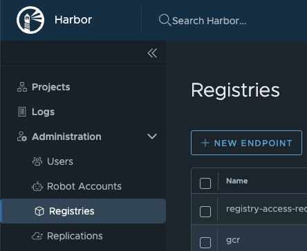
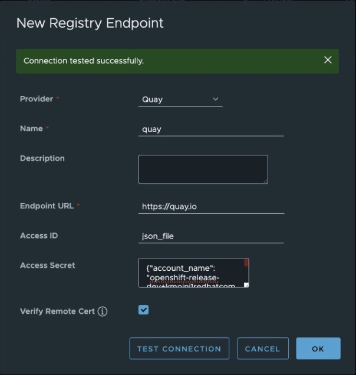
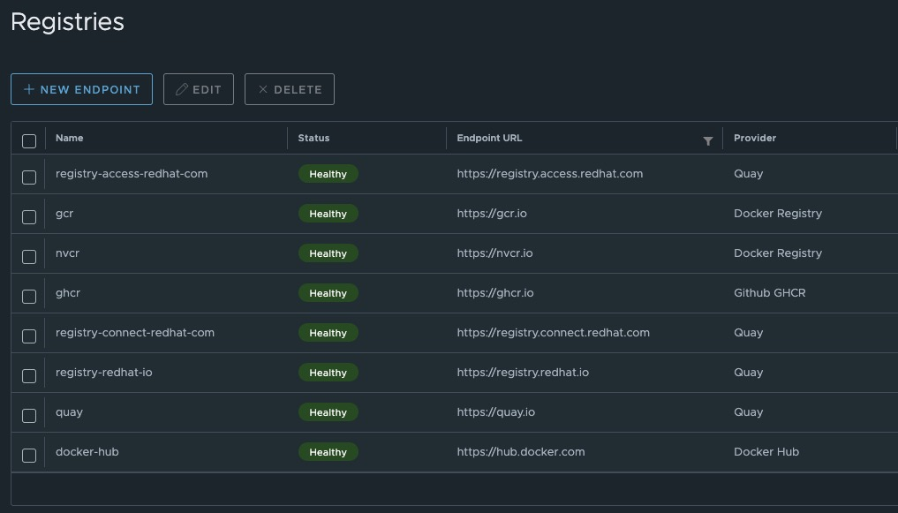
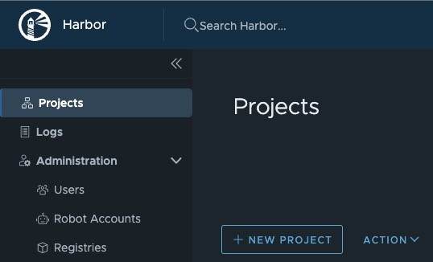
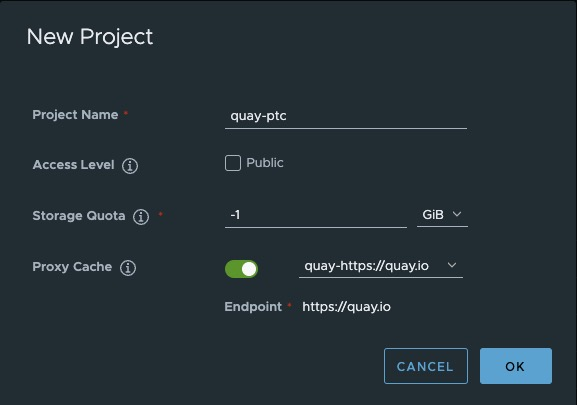
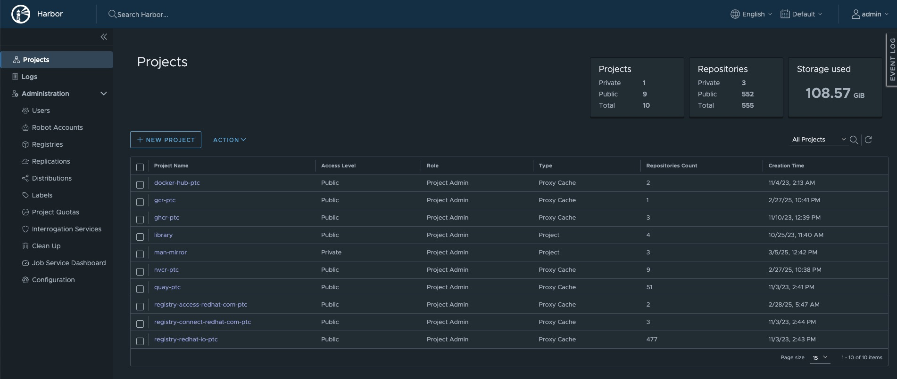

# Pull-through Proxy Cache - Harbor

If you have an existing Harbor Container Registry deployment, you can use that to proxy in container images from the public internet for use in adjacent limited networks.

## Prerequisites

- Obtain Red Hat Pull Secret: https://console.redhat.com/openshift/downloads#tool-pull-secret
- Store the Red Hat Pull Secret in a file such as `rh-pull-secret.json`
- `jq`

## 1. Extracting and Formatting the Pull Secret

Harbor uses a non-standard format for it's authentication credentials so you need to convert your normal Pull Secret JSON.

Normal pull secret auth: `{"auths": {"registry.example.com": {"auth": "bigBase64String"}, {"quay.io": {"auth": "bigBase64String"} }}`
Harbor auth JSON: `{"account_name": "USERNAME", "docker_cli_password": "PASSWORD"}`

To make quick work of this, you can use the [./scripts/pull-secret-to-harbor-auth.sh](../scripts/pull-secret-to-harbor-auth.sh) helper script to take your normal Red Hat Pull Secret JSON file and extract it into separate files to be used with Harbor.

---

## 2. Create Registry Endpoints

First define a Registry Endpoint for the upstream remote repositories - let's start with Quay.

In Harbor, navigate to **Administration > Registries**.  Click the **+ New Endpoint** button.

Fill out the form as shown below - take the JSON files generated from the [scripts/pull-secret-to-harbor-auth.sh](../scripts/pull-secret-to-harbor-auth.sh) for Quay and provide it in that tiny little box - Access ID needs to be `json_file`.  Test the registry endpoint and click Save.

> Rinse and repeat for the other registries and you'll end up with something like this:

---

## 3. Create Projects

With the Registry Endpoints created we can now create a series of Projects.

In Harbor, navigate to **Projects** - click the **+ New Project** button.

Fill out the form as shown below - pretty simple really.

> Once again, rinse and repeat for the other registry, your projects list should look something like this:

---

With that you now need to create some Robot Accounts to be able to pull from the registry.  Now if you want to get to `quay.io/kenmoini/banana-phone:latest` you can access it via `harbor.example.com/quay-ptc/kenmoini/banana-phone:latest`.  You can configure Linux systems with a file in `/etc/containers/registries.conf.d` that will automatically forward requests to mirrors, which is what OpenShift ends up creating and curating at the end of the day.
