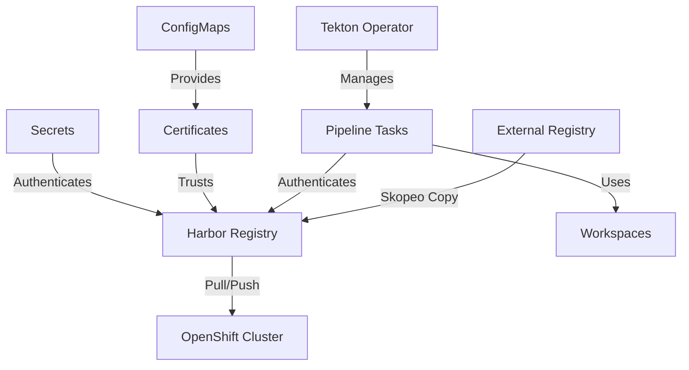

# System Integration Guide

## Overview

This guide details how the OpenShift cluster integrates with other components in the disconnected environment. It provides a comprehensive view of system boundaries, integration points, and workflows.

## System Architecture

### Core Components

1. **OpenShift Cluster**
   - 3 Control Plane nodes (<ip-address>-23)
   - 6 Worker nodes (<ip-address>-29)
   - Version: 4.18.4
   - Container Runtime: CRI-O 1.31.6

2. **Harbor Registry**
   - Dedicated namespace: harbor-pipelines
   - Certificate management
   - Authentication system
   - Image storage and distribution

3. **Tekton Pipelines**
   - Version: 1.18.0
   - Custom tasks for disconnected operations
   - Workspace management
   - Authentication integration

### Integration Points



## Authentication Flow

### 1. Registry Authentication
```yaml
# Location: harbor-pipelines namespace
configMap:
  - name: mirror-registry-config
  - name: root-ca-certs
  - name: config-trusted-cabundle
```

### 2. Certificate Trust Chain
```yaml
# Required ConfigMaps
- openshift-config/harbor-ca
  - ca-bundle.crt

# Cluster Configuration
proxy.config.openshift.io/cluster:
  spec:
    trustedCA:
      name: harbor-ca
```

### 3. Pipeline Authentication
```yaml
# Workspace Mounts
- name: authsecret
  mountPath: /tmp/authsecret
- name: root-ca-certs
  mountPath: /etc/pki/tls/certs
```

## Network Configuration

### 1. Network Topology
```plaintext
Lab Network (Connected):
- CIDR: <ip-address>/24
- Gateway: <ip-address>
- Used for: Initial setup and management

Trans-Proxy Network (Disconnected):
- CIDR: <ip-address>/24
- Gateway: <ip-address>
- Used for: Disconnected operations
```

### 2. Network Policies
```yaml
# Required Access
- Harbor Registry <-> OpenShift Nodes
- Tekton Pipelines <-> Harbor Registry
- External Registry <-> Harbor Registry (initial sync)
```

## Workflow Integration

### 1. Image Mirroring
```yaml
# Task: skopeo-copy-disconnected
steps:
  - name: skopeo-copy
    image: quay.io/skopeo/stable
    command: ["skopeo", "copy"]
    args:
      - "--src-tls-verify=$(params.SRC_TLS_VERIFY)"
      - "--dest-tls-verify=$(params.DEST_TLS_VERIFY)"
      - "$(params.SOURCE_IMAGE_URL)"
      - "$(params.DESTINATION_IMAGE_URL)"
```

### 2. Pipeline Tasks
```yaml
Available Tasks:
- buildah-disconnected.yml
- skopeo-copy-disconnected.yml
- ocp-release-tools.yml
```

## Health Monitoring

### 1. Component Health Checks
```bash
# Check cluster operators
oc get co

# Verify Harbor status
curl -k https://<your-domain>

# Check pipeline operator
oc get csv -n openshift-operators | grep pipelines
```

### 2. Integration Health
```bash
# Test registry access
podman login ${HARBOR_HOSTNAME}

# Verify pipeline execution
tkn pipelinerun list -n harbor-pipelines

# Check certificate trust
openssl verify -CAfile /etc/pki/ca-trust/source/anchors/harbor.crt \
    /etc/pki/ca-trust/source/anchors/harbor.crt
```

## Troubleshooting

### 1. Certificate Issues
```bash
# Fix missing certificate
oc create configmap harbor-ca \
  --from-file=ca-bundle.crt=/path/to/harbor/cert \
  -n openshift-config

# Update proxy configuration
oc patch proxy/cluster \
  --type=merge \
  --patch='{"spec":{"trustedCA":{"name":"harbor-ca"}}}'
```

### 2. Pipeline Failures
```bash
# View pipeline logs
tkn pipelinerun logs -f <pipelinerun-name>

# Check pod events
oc get events -n harbor-pipelines

# Verify workspace mounts
oc describe pod <pod-name> -n harbor-pipelines
```

### 3. Registry Access Issues
```bash
# Test registry connection
curl -k https://${HARBOR_HOSTNAME}/v2/

# Verify authentication
oc get secret registry-auth -n harbor-pipelines

# Check network connectivity
ping ${HARBOR_HOSTNAME}
```

## Maintenance Procedures

### 1. Certificate Rotation
```bash
# Update Harbor certificate
oc create configmap harbor-ca \
  --from-file=ca-bundle.crt=/path/to/new/cert \
  -n openshift-config --dry-run=client -o yaml | \
  oc replace -f -

# Verify update
oc get configmap harbor-ca -n openshift-config -o yaml
```

### 2. Pipeline Updates
```bash
# Update pipeline operator
oc patch subscription openshift-pipelines-operator-rh \
  --type=merge -p '{"spec":{"channel":"latest"}}'

# Update tasks
oc apply -f tekton/tasks/
```

### 3. System Backup
```bash
# Backup critical configs
oc get configmap -n harbor-pipelines -o yaml > backup/harbor-config.yaml
oc get secret -n harbor-pipelines -o yaml > backup/harbor-secrets.yaml
oc get pipelinerun -n harbor-pipelines -o yaml > backup/pipeline-runs.yaml
```

## Reference

- [OpenShift Documentation](https://<your-domain>
- [Harbor Documentation](https://<your-domain>
- [Tekton Documentation](https://<your-domain>
- [Project Documentation](docs/) 