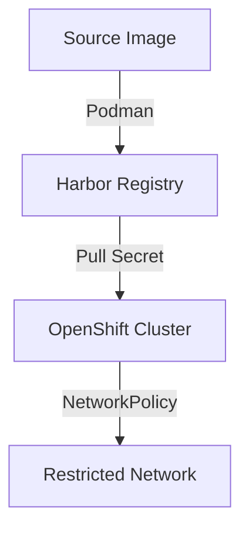
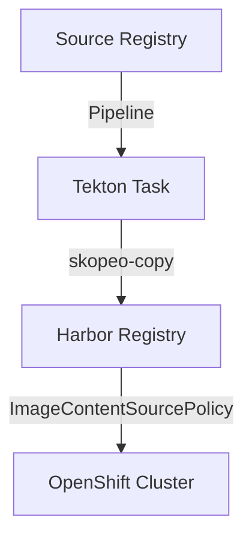
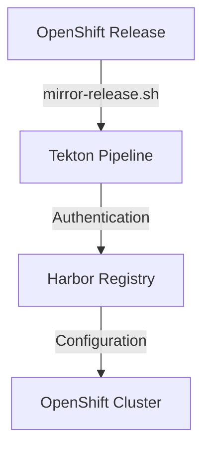

# Disconnected OpenShift Workflow Documentation

## System Architecture Overview

### 1. Core Components

#### 1.1 Harbor Registry
- **Status**: ✅ Configured and Tested
- **Location**: `<ip-address>`
- **Features**:
  - SSL/TLS enabled
  - Authentication configured
  - Project creation automated
  - Image push/pull verified

#### 1.2 OpenShift Cluster
- **Status**: ✅ Operational
- **Features**:
  - Authentication with Harbor verified
  - Network connectivity established
  - Security contexts configured (anyuid)
  - Image pull secrets configured

#### 1.3 Tekton Pipelines
- **Status**: 🔄 Available but not yet utilized
- **Components**:
  - `skopeo-copy-disconnected` task
  - `buildah-disconnected` task
  - Release mirroring pipelines
  - Auto-mirror integration

### 2. Integration Points

#### 2.1 Harbor-OpenShift Integration
- **Status**: ✅ Verified
- **Tested Functionality**:
  - Project creation
  - Image push/pull
  - Authentication
  - Network policies
  - Security contexts

#### 2.2 Tekton-Harbor Integration
- **Status**: 🔄 Ready for Use
- **Available Workflows**:
  - Direct image mirroring
  - Release image mirroring
  - Build and push workflows

## Current Progress

### 1. Completed Steps
1. ✅ Harbor installation and configuration
2. ✅ OpenShift cluster setup
3. ✅ Harbor-OpenShift integration testing
4. ✅ Basic <base64-credentials>
5. ✅ Network policy testing
6. ✅ Security context configuration

### 2. Current Phase
- **Status**: Ready for Release Image Mirroring
- **Available Tools**:
  - `mirror-release.sh` script
  - Tekton pipelines for mirroring
  - Ansible automation playbooks

### 3. Next Steps
1. 🔄 Configure release image mirroring
2. 🔜 Set up automated sync workflows
3. 🔜 Implement monitoring and alerts
4. 🔜 Configure backup procedures

## Workflow Paths

### 1. Manual Image Mirroring


### 2. Automated Mirroring via Tekton


### 3. Release Image Mirroring


## Configuration Status

### 1. Harbor Configuration
```yaml
Status: Configured
Projects:
  - harbor-test: Created and tested
Authentication:
  - Admin credentials: Configured
  - Robot accounts: Available
SSL/TLS: Enabled
```

### 2. OpenShift Configuration
```yaml
Status: Configured
Namespaces:
  - harbor-test: Created and tested
Security:
  - Pull Secrets: Configured
  - SCC (anyuid): Applied
NetworkPolicies: Tested
```

### 3. Tekton Configuration
```yaml
Status: Available
Pipelines:
  - skopeo-copy-disconnected: Ready
  - ocp-release-mirror: Ready
Tasks:
  - buildah-disconnected: Available
  - ocp-release-tools: Available
```

## Testing Status

### 1. Completed Tests
- ✅ Harbor accessibility
- ✅ Image push to Harbor
- ✅ Image pull from Harbor
- ✅ OpenShift integration
- ✅ Network isolation
- ✅ Security context permissions

### 2. Pending Tests
- 🔄 Release image mirroring
- 🔜 Automated sync workflows
- 🔜 Failure recovery
- 🔜 Backup and restore

## Next Actions

1. **Release Image Mirroring**
   - Configure authentication
   - Set up mirroring pipeline
   - Test image sync
   - Verify cluster access

2. **Automation**
   - Implement periodic sync
   - Configure monitoring
   - Set up alerts
   - Document procedures

3. **Documentation**
   - Update procedures
   - Create troubleshooting guide
   - Document recovery processes
   - Maintain workflow documentation

## Notes

- Current focus is on establishing release image mirroring
- All basic integration points have been verified
- System is ready for production workload testing
- Documentation will be updated as new features are implemented

---
Last Updated: March 26, 2024 

# Script Workflow Documentation

This document outlines the logical workflow and relationships between the scripts in the Disconnected OpenShift repository.

## Script Execution Flow

```mermaid
graph TD
    A[Start] --> B[validate_environment.sh]
    B -->|Validation Success| C[build_environment.sh]
    B -->|Validation Failure| Z[Exit]
    
    C -->|Build Success| D[demo.sh]
    C -->|Build Failure| Z
    
    D -->|Options| E[Demo Selection]
    
    E -->|--all| F[Run All Demos]
    E -->|--validate| G[Validation Demo]
    E -->|--mirror| H[Mirror Demo]
    E -->|--registry| I[Registry Demo]
    E -->|--proxy| J[Proxy Demo]
    E -->|--automation| K[Automation Demo]
    E -->|--security| L[Security Demo]
    E -->|--monitoring| M[Monitoring Demo]
    E -->|--tekton| N[Tekton Demo]
    E -->|--quay| O[Quay Demo]
    E -->|--rulebooks| P[Rulebooks Demo]
    E -->|--gitops| Q[GitOps Demo]
    E -->|--install| R[Install Demo]
    E -->|--extras| S[Extras Demo]
    E -->|--ee| T[EE Demo]
    
    F --> U[End]
    G --> U
    H --> U
    I --> U
    J --> U
    K --> U
    L --> U
    M --> U
    N --> U
    O --> U
    P --> U
    Q --> U
    R --> U
    S --> U
    T --> U

    subgraph "Existing OpenShift Cluster"
        OS1[OpenShift Cluster] --> OS2[Authentication]
        OS1 --> OS3[Namespaces]
        OS1 --> OS4[Operators]
        OS1 --> OS5[Storage]
    end

    subgraph "Prerequisites"
        B -->|Checks| B1[System Requirements]
        B -->|Checks| B2[Network Requirements]
        B -->|Checks| B3[Storage Configuration]
        B -->|Checks| B4[Security Requirements]
        B -->|Checks| B5[OpenShift Requirements]
        B -->|Checks| B6[Software Versions]
        B -->|Checks| B7[Environment Variables]
        B -->|Checks| B8[File Structure]
        B -->|Checks| B9[Package Dependencies]
    end

    subgraph "Environment Setup"
        C -->|Configures| C1[Install Packages]
        C -->|Configures| C2[Configure SELinux]
        C -->|Configures| C3[Configure Firewall]
        C -->|Configures| C4[Configure DNS]
        C -->|Configures| C5[Generate Certificates]
        C -->|Configures| C6[Create Directories]
        C -->|Configures| C7[Setup Python Environment]
        C -->|Configures| C8[Configure OpenShift Integration]
    end

    subgraph "OpenShift Integration"
        C8 -->|Creates| I1[Required Namespaces]
        C8 -->|Sets up| I2[Storage Classes]
        C8 -->|Configures| I3[Network Policies]
        C8 -->|Installs| I4[Required Operators]
        C8 -->|Sets up| I5[Monitoring Stack]
    end

    subgraph "Demo Components"
        N -->|Requires| N1[OpenShift Pipelines]
        N -->|Requires| N2[Workspace PVC]
        N -->|Requires| N3[Demo Tasks]
        N -->|Requires| N4[Demo Pipeline]
        
        I -->|Requires| I1[Harbor Registry]
        I -->|Requires| I2[Pull-through Cache]
        I -->|Requires| I3[Registry Authentication]
        
        M -->|Requires| M1[Monitoring Stack]
        M -->|Requires| M2[Alert Configuration]
        M -->|Requires| M3[Dashboard Setup]
    end

    subgraph "Integration Points"
        C8 -->|Verifies| IP1[Cluster Access]
        C8 -->|Configures| IP2[Registry Integration]
        C8 -->|Sets up| IP3[Monitoring Integration]
        C8 -->|Prepares| IP4[Demo Resources]
    end
```



## Script Dependencies

1. **validate_environment.sh**
   - First script to run
   - Checks all prerequisites
   - Generates validation summary
   - Required for all other operations

2. **build_environment.sh**
   - Runs after successful validation
   - Configures environment for existing OpenShift cluster
   - Sets up required components:
     - Namespaces
     - Storage classes
     - Network policies
     - Operators
     - Monitoring stack
   - Prepares demo resources

3. **demo.sh**
   - Runs after environment setup
   - Uses configured environment to run demos
   - Interacts with existing OpenShift cluster
   - Manages demo-specific resources

## Execution Order

1. Run validation:
   ```bash
   ./scripts/validate_environment.sh
   ```

2. Build environment:
   ```bash
   ./scripts/build_environment.sh
   ```

3. Run demos:
   ```bash
   ./scripts/demo.sh [OPTIONS]
   ```

## Common Requirements

- Existing OpenShift cluster
- Harbor registry
- Required software versions
- System resources
- Network connectivity
- Storage configuration
- Security settings

## Logging and Output

All scripts:
- Use color-coded output
- Generate timestamped logs
- Create markdown summaries where applicable
- Handle errors gracefully
- Provide cleanup on exit 